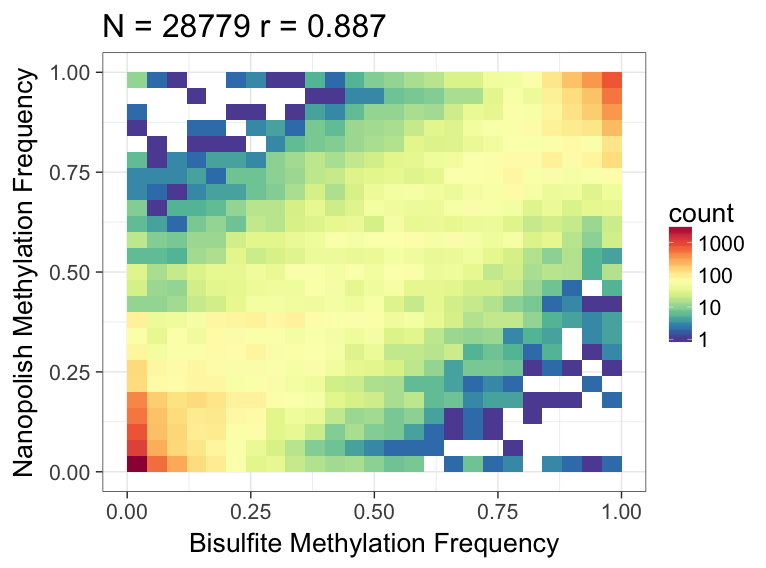

.. _quickstart_call_methylation:

Quickstart - calling methylation with nanopolish
=====================================================

Oxford Nanopore sequencers are sensitive to base modifications. Here we provide a step-by-step tutorial to help you get started with detecting base modifications using nanopolish.

**For more information about our approach:**

* Simpson, Jared T., et al. `"Detecting DNA cytosine methylation using nanopore sequencing." <https://www.nature.com/articles/nmeth.4184>`_ Nature Methods (2017). 

**Requirements**:

* `nanopolish v0.8.4 <installation.html>`_
* `samtools v1.2 <https://htslib.org>`_
* `minimap2 <https://github.com/lh3/minimap2>`_

Download example dataset
------------------------------------

In this tutorial we will use a subset of the `NA12878 WGS Consortium data <https://github.com/nanopore-wgs-consortium/NA12878/blob/master/Genome.md>`_. You can download the example dataset we will use here (warning: the file is about 2GB): ::

    wget http://s3.climb.ac.uk/nanopolish_tutorial/methylation_example.tar.gz
    tar -xvf methylation_example.tar.gz
    cd methylation_example

**Details**:

* Sample :	Human cell line (NA12878)
* Basecaller : Albacore v2.0.2
* Region: chr20:5,000,000-10,000,000

In the extracted example data you should find the following files:

* ``albacore_output.fastq`` : the subset of the basecalled reads
* ``reference.fasta`` : the chromsome 20 reference sequence
* ``fast5_files/`` : a directory containing signal-level FAST5 files

The reads were basecalled using this albacore command: ::

    read_fast5_basecaller.py -c r94_450bps_linear.cfg -t 8 -i fast5_files -s basecalled/ -o fastq

After the basecaller finished, we merged all of the fastq files together into a single file: ::

    cat basecalled/workspace/pass/*.fastq > albacore_output.fastq

Data preprocessing
------------------------------------

nanopolish needs access to the signal-level data measured by the nanopore sequencer. To begin, we need to create an index file that links read ids with their signal-level data in the FAST5 files: ::

    nanopolish index -d fast5_files/ albacore_output.fastq

We get the following files: ``albacore_output.fastq.index``, ``albacore_output.fastq.index.fai``, ``albacore_output.fastq.index.gzi``, and ``albacore_output.fastq.index.readdb``.

Aligning reads to the reference genome
--------------------------------------

Next, we need to align the basecalled reads to the reference genome. We use minimap2 as it is fast enough to map reads to the human genome. In this example we'll pipe the output directly into ``samtools sort`` to get a sorted bam file: ::

    minimap2 -a -x map-ont reference.fasta albacore_output.fastq | samtools sort -T tmp -o albacore_output.sorted.bam
    samtools index albacore_output.sorted.bam

Calling methylation
-------------------

Now we're ready to use nanopolish to detect methylated bases (in this case 5-methylcytosine in a CpG context). The command is fairly straightforward - we have to tell it what reads to use (``albacore_output.fastq``), where the alignments are (``albacore_output.sorted.bam``), the reference genome (``reference.fasta``) and what region of the genome we're interested in (``chr20:5,000,000-10,000,000``)::
	
    nanopolish call-methylation -t 8 -r albacore_output.fastq -b albacore_output.sorted.bam -g reference.fasta -w "chr20:5,000,000-10,000,000" > methylation_calls.tsv

The output file contains a lot of information including the position of the CG dinucleotide on the reference genome, the ID of the read that was used to make the call, and the log-likelihood ratio calculated by our model: ::

	chromosome  start    end      read_name                             log_lik_ratio  log_lik_methylated  log_lik_unmethylated  num_calling_strands  num_cpgs  sequence
	chr20       4980553  4980553  c1e202f4-e8f9-4eb8-b9a6-d79e6fab1e9a  3.70           -167.47             -171.17               1                    1         TGAGACGGGGT
	chr20       4980599  4980599  c1e202f4-e8f9-4eb8-b9a6-d79e6fab1e9a  2.64           -98.87              -101.51               1                    1         AATCTCGGCTC
	chr20       4980616  4980616  c1e202f4-e8f9-4eb8-b9a6-d79e6fab1e9a  -0.61          -95.35              -94.75                1                    1         ACCTCCGCCTC
	chr20       4980690  4980690  c1e202f4-e8f9-4eb8-b9a6-d79e6fab1e9a  -2.99          -99.58              -96.59                1                    1         ACACCCGGCTA
	chr20       4980780  4980780  c1e202f4-e8f9-4eb8-b9a6-d79e6fab1e9a  5.27           -135.45             -140.72               1                    1         CACCTCGGCCT
	chr20       4980807  4980807  c1e202f4-e8f9-4eb8-b9a6-d79e6fab1e9a  -2.95          -89.20              -86.26                1                    1         ATTACCGGTGT
	chr20       4980820  4980822  c1e202f4-e8f9-4eb8-b9a6-d79e6fab1e9a  7.47           -90.63              -98.10                1                    2         GCCACCGCGCCCA
	chr20       4980899  4980901  c1e202f4-e8f9-4eb8-b9a6-d79e6fab1e9a  3.17           -96.40              -99.57                1                    2         GTATACGCGTTCC
	chr20       4980955  4980955  c1e202f4-e8f9-4eb8-b9a6-d79e6fab1e9a  0.33           -92.14              -92.47                1                    1         AGTCCCGATAT

A positive value in the ``log_lik_ratio`` column indicates support for methylation. We have provided a helper script that can be used to calculate how often each reference position was methylated: ::

	scripts/calculate_methylation_frequency.py -i methylation_calls.tsv > methylation_frequency.tsv

The output is another tab-separated file, this time summarized by genomic position: ::

	chromosome  start    end      num_cpgs_in_group  called_sites  called_sites_methylated  methylated_frequency  group_sequence
	chr20       5036763  5036763  1                  21            20                       0.952                 split-group
	chr20       5036770  5036770  1                  21            20                       0.952                 split-group
	chr20       5036780  5036780  1                  21            20                       0.952                 split-group
	chr20       5037173  5037173  1                  13            5                        0.385                 AAGGACGTTAT

In the example data set we have also included bisulfite data from ENCODE for the same region of chromosome 20. We can use the included ``compare_methylation.py`` helper script to do a quick comparison between the nanopolish methylation output and bisulfite: ::

    python compare_methylation.py bisulfite.ENCFF835NTC.example.tsv methylation_frequency.tsv > bisulfite_vs_nanopolish.tsv

We can use R to visualize the results - we observe good correlation between the nanopolish methylation calls and bisulfite: ::

    library(ggplot2)
    library(RColorBrewer)
    data <- read.table("bisulfite_vs_nanopolish.tsv", header=T)

    # Set color palette for 2D heatmap
    rf <- colorRampPalette(rev(brewer.pal(11,'Spectral')))
    r <- rf(32)

    c <- cor(data$frequency_1, data$frequency_2)
    title <- sprintf("N = %d r = %.3f", nrow(data), c)
    ggplot(data, aes(frequency_1, frequency_2)) +
        geom_bin2d(bins=25) + scale_fill_gradientn(colors=r, trans="log10") +
        xlab("Bisulfite Methylation Frequency") +
        ylab("Nanopolish Methylation Frequency") +
        theme_bw(base_size=20) +
        ggtitle(title)

Here's what the output should look like:

