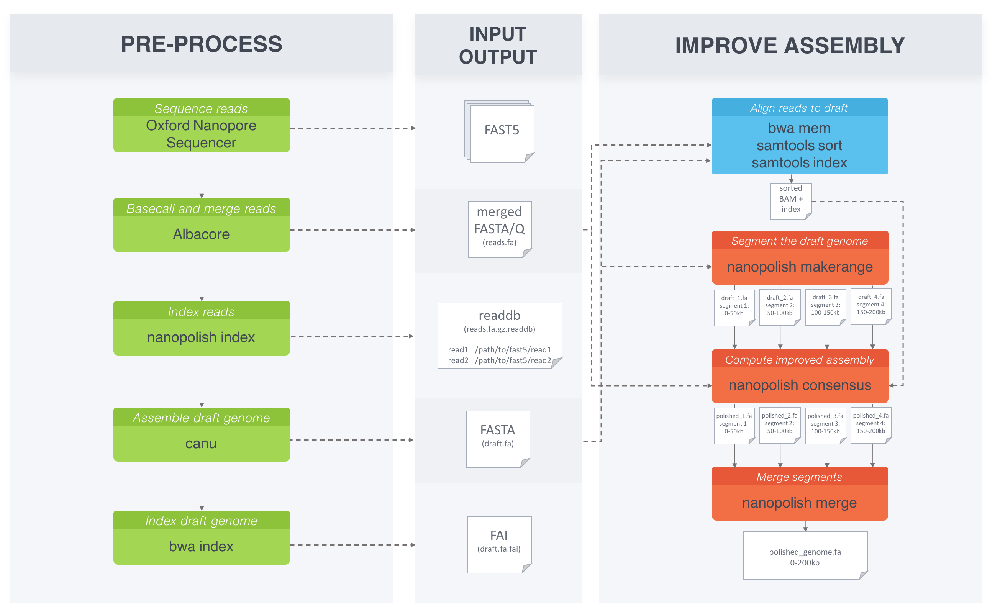

.. _quickstart_consensus:

Quickstart - how to polish a genome assembly
===================================================

The original purpose of nanopolish was to improve the consensus accuracy of an assembly of Oxford Nanopore Technology sequencing reads. Here we provide a step-by-step tutorial to help you get started.

**Requirements**:

* `nanopolish <installation.html>`_
* `samtools <https://htslib.org>`_
* `minimap2 <https://github.com/lh3/minimap2>`_
* `MUMmer <https://github.com/mummer4/mummer>`_

Download example dataset
------------------------------------

You can download the example dataset we will use here: ::

    wget http://s3.climb.ac.uk/nanopolish_tutorial/ecoli_2kb_region.tar.gz
    tar -xvf ecoli_2kb_region.tar.gz
    cd ecoli_2kb_region

**Details**:

* Sample :	E. coli str. K-12 substr. MG1655
* Instrument : MinION sequencing R9.4 chemistry
* Basecaller : Albacore v2.0.1
* Region: "tig00000001:200000-202000"
* Note: Ligation-mediated PCR amplification performed

This is a subset of reads that aligned to a 2kb region in the E. coli draft assembly. To see how we generated these files please refer to the tutorial :ref:`creating_example_dataset <here>`.

You should find the following files:

* ``reads.fasta`` : subset of basecalled reads
* ``draft.fa`` : draft genome assembly
* ``draft.fa.fai`` : draft genome assembly index
* ``fast5_files/`` : a directory containing FAST5 files
* ``ecoli_2kb_region.log`` : a log file for how the dataset was created with nanopolish helper script (``scripts/extract_reads_aligned_to_region.py``) 

For the evaluation step you will need the reference genome: ::

    curl -o ref.fa https://ftp.ncbi.nih.gov/genomes/archive/old_genbank/Bacteria/Escherichia_coli_K_12_substr__MG1655_uid225/U00096.ffn

Analysis workflow
-------------------------------

The pipeline below describes the recommended analysis workflow for larger datasets. In this tutorial, we will run through the basic steps of the pipeline for this smaller (2kb) dataset.

Data preprocessing
------------------------------------

nanopolish needs access to the signal-level data measured by the nanopore sequencer. To begin, we need to create an index ``readdb`` file that links read ids with their signal-level data in the FAST5 files: ::

    nanopolish index -d fast5_files/ reads.fasta

We get the following files: ``reads.fasta.index``, ``reads.fasta.index.fai``, ``reads.fasta.index.gzi``, and ``reads.fasta.index.readdb``.

Compute the draft genome assembly using canu
-----------------------------------------------

As computing the draft genome assembly takes a few hours we have included the pre-assembled data for you (``draft.fa``).
We used the following parameters with `canu <http://canu.readthedocs.io/en/latest/>`_: ::

    canu \
        -p ecoli -d outdir genomeSize=4.6m \
        -nanopore-raw albacore-2.0.1-merged.fastq

Compute a new consensus sequence for a draft assembly
------------------------------------------------------------------------

Now that we have ``reads.fasta`` indexed with ``nanopolish index``, and have a draft genome assembly ``draft.fa``, we can begin to improve the assembly with nanopolish. Let us get started! 

First step, is to index the draft genome assembly. We can do that with the following command: ::

    minimap2 -d draft.mmi draft.fa

Next, we align the original reads (``reads.fasta``) to the draft assembly (``draft.fa``) and sort alignments: ::

    minimap2 -ax map-ont -t 8 draft.fa reads.fasta | samtools sort -o reads.sorted.bam -T reads.tmp
    samtools index reads.sorted.bam

**Checkpoint**: we can do a quick check to see if this step worked. The bam file should not be empty. ::

    samtools view reads.sorted.bam | head

Then we run the consensus algorithm. For larger datasets we use ``nanopolish_makerange.py`` to split the draft genome assembly into 50kb segments, so that we can run the consensus algorithm on each segment in parallel. The output would be the polished segments in ``fasta`` format. 
Since our dataset is only covering a 2kb region, we skip this step and use the following command: ::

    nanopolish variants --consensus polished.fa \
        -w "tig00000001:200000-202000" \
        -r reads.fasta \
        -b reads.sorted.bam \
        -g draft.fa

We are left with our desired output: ``polished.fa``.

Evaluate the assembly
---------------------------------

To analyze how nanopolish performed improving the accuracy we use `MUMmer <https://github.com/mummer4/mummer>`_. MUMmer contains "dnadiff", a program that enables us to see a report on alignment statistics. With dnadiff we can compare the two different assemblies. ::

    mkdir analysis
    MUMmer3.23/dnadiff --prefix analysis/draft.dnadiff ref.fa draft.fa
    MUMmer3.23/dnadiff --prefix analysis/polished.dnadiff ref.fa polished.fa

This generates ``draft.dnadiff.report`` and ``polished.dnadiff.report`` along with other files. The metric we are interested in is ``AvgIdentity`` under ``[ Alignments ] 1-to-1``, which is a measurement of how similar the genome assemblies are to the reference genome. We expect to see a higher value for the polished assembly than the draft ( ``99.90`` vs ``99.53`` ), concluding that the nanopolish consensus algorithm worked successfully.

.. note:: The example dataset was PCR amplified causing a loss of methylation information. We recommend using the ``-q dam,dcm`` with ``nanopolish variants --consensus`` if you have data with methylation information to account for known bacterial methyltransferases.
